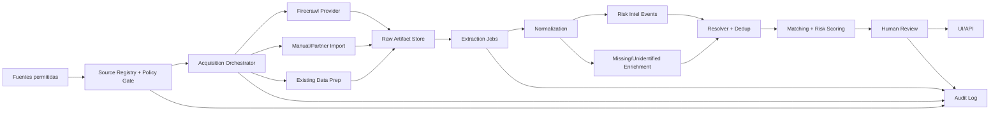

# 01. Arquitectura

## Objetivo

Agregar a Hilo una capa de adquisicion web/social que alimente inteligencia contextual y enriquecimiento de casos sin romper las reglas del proyecto:

- individuos reales solo con consentimiento o fuente autorizada;
- datos reales publicos solo agregados o minimizados;
- ninguna conclusion automatica;
- provenance y auditoria por cada transformacion.

## Vista de sistema

## Modulos

| Modulo | Responsabilidad | Tablas |
|---|---|---|
| `source-registry` | Registrar fuentes, permisos, retencion, nivel de confianza y acciones permitidas. | `sources`, `source_permissions` |
| `acquisition` | Ejecutar busquedas/scrapes/imports idempotentes, guardar raw artifacts. | `acquisition_runs`, `raw_artifacts` |
| `extraction` | Extraer eventos, fichas, ofertas laborales, senas y metadatos estructurados. | `extraction_jobs`, `extracted_payloads` |
| `normalization` | Resolver estado/municipio, fechas, duplicados, categorias y vocabularios. | `normalized_entities`, `features` |
| `risk-intel` | Crear eventos sociales agregables por municipio y ventana temporal. | `social_risk_events`, `risk_event_links` |
| `matching` | Usar contexto como senal secundaria; mantener el core forense independiente. | `candidate_matches` |
| `review` | Revisar, aprobar/rechazar, ocultar, escalar, auditar. | `reviews`, `audit_log` |

## Workflow vs swarm

Usar workflow. Un swarm suena bien para demo, pero aqui cada capa llena tablas distintas y necesita idempotencia, trazabilidad y permisos. El modelo correcto es:

| Pieza | Forma correcta | Por que |
|---|---|---|
| Busqueda web | Worker/nodo con tool Firecrawl | Accion concreta, retry, rate limit, provenance. |
| Scraping de paginas autorizadas | Worker/nodo | Produce `raw_artifacts`; debe ser auditable. |
| Extraccion LLM | Nodo deterministico + LLM fallback/upgrade | Debe devolver schema, confidence y errores. |
| Recomendacion | Funcion o llamada LLM si solo analiza | No es agente si no decide acciones ni usa tools. |
| Demo visual | Vista de workflow en vivo | Puede parecer multi-agente sin perder control. |

## Donde si hay agentes

Un "agente" se justifica si tiene:

- herramientas externas;
- memoria/estado de tarea;
- decision sobre siguiente accion;
- presupuesto/retries;
- salida auditable.

Propuesta:

| Agente/worker | Acciones | Salida |
|---|---|---|
| `official-source-researcher` | Buscar y mapear fuentes oficiales/fiscalias/comisiones. | `source_candidates`, `raw_artifacts`. |
| `public-web-acquirer` | Search/scrape/crawl con Firecrawl solo sobre fuentes permitidas. | `raw_artifacts`. |
| `social-intel-extractor` | Extraer eventos sociales desde artefactos autorizados. | `social_risk_events`. |
| `missing-case-extractor` | Extraer fichas publicas/autorizadas. | `records`, `features`, `extracted_payloads`. |
| `review-recommender` | Priorizar colas para humanos. | `review_tasks`; no confirma nada. |

## Modos de ejecucion

| Modo | Uso | Comportamiento |
|---|---|---|
| `scheduled_refresh` | Produccion | Corre cada N horas/dias por fuente aprobada. |
| `manual_authorized_import` | Colectivo/familia/admin | Ingresa links, screenshots o archivos con consentimiento. |
| `demo_live` | Hackathon | Muestra workers en paralelo y va pintando el mapa con datos synthetic/sembrados. |
| `investigation_sandbox` | Analisis interno | Guarda resultados privados, sin publicarlos al mapa. |

## Reglas de frontera

- El core de matching no sabe de Firecrawl.
- Firecrawl no escribe directo en `records` ni `social_risk_events`; solo en `raw_artifacts`.
- Todo extractor debe declarar version, schema y confidence.
- El mapa publico solo consume agregados o eventos aprobados.
- La UI de demo puede mostrar "trabajando en paralelo"; la base debe preservar orden, logs y run IDs.

