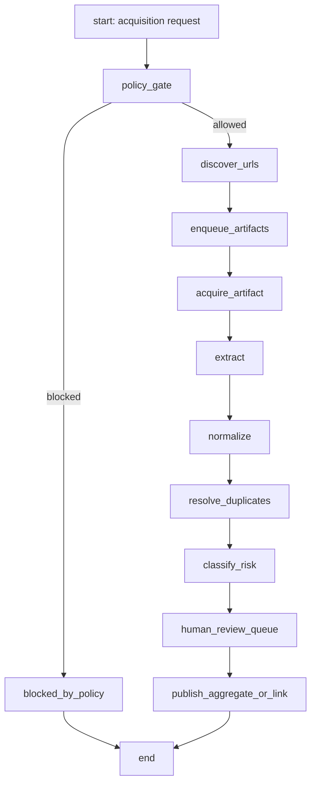

# 03. Workflows

## StateGraph recomendado

El flujo cabe bien en LangGraph `StateGraph`: nodos con estado tipado, edges condicionales, reducers para listas de artifacts/eventos y checkpoints para demo/observabilidad.

Para el MVP del repo actual, el runtime debe ser TypeScript-first: un state machine simple o `langgraphjs` si no agrega friccion. Un proceso Python con LangGraph queda como opcion posterior si el equipo acepta deploy poliglota.



## Estado compartido minimo

```ts
type AcquisitionWorkflowState = {
  runId: string;
  sourceId?: string;
  mode: "discovery_search" | "search" | "scrape" | "map" | "crawl" | "monitor" | "manual_import";
  seedQuery?: string;
  seedUrl?: string;
  policy: SourcePolicyDecision;
  discoveredUrls: DiscoveredUrl[];
  rawArtifactIds: string[];
  extractionJobIds: string[];
  socialRiskEventIds: string[];
  errors: WorkflowError[];
};
```

## Nodos

| Nodo | Entrada | Salida | Tabla |
|---|---|---|---|
| `policy_gate` | source/query/url/mode | allow/block + policy snapshot | `acquisition_runs` |
| `discover_urls` | query/url | URLs candidatas | no final; pasa a queue |
| `enqueue_artifacts` | URLs permitidas | jobs idempotentes | `acquisition_runs` |
| `acquire_artifact` | URL/job | markdown/html/json/screenshot metadata | `raw_artifacts` |
| `extract` | artifact | payload estructurado | `extraction_jobs` |
| `normalize` | payload | entidades/eventos normalizados | `features`, `social_risk_events` |
| `resolve_duplicates` | entidades/eventos | clusters/links | `risk_event_links` |
| `classify_risk` | eventos | severity/confidence/privacy | `social_risk_events` |
| `human_review_queue` | eventos/casos | tareas de revision | `reviews` |
| `publish_aggregate_or_link` | aprobado | mapa agregado o contexto de match | API/UI |

## Contratos de nodo

Cada nodo debe:

- ser idempotente por `idempotency_key` en runs, `run_id + url + content_hash` en artifacts y `artifact + extractor_version + schema` en extracciones;
- registrar error recuperable o no recuperable;
- nunca escribir fuera de su modulo;
- emitir eventos de observabilidad para la demo;
- tener timeout y retries limitados.

## Demo visual

Para que se vea "no hardcodeado":

1. Crear un `run_id` nuevo visible en UI.
2. Mostrar seeds: query, URL o fuente autorizada.
3. Pintar cada artifact cuando llega con hash y timestamp.
4. Mostrar extracciones con confidence y "needs review".
5. Pintar el mapa solo cuando el evento pasa revision o cuando es synthetic demo.
6. Mostrar consola/event stream con nodos reales, no mensajes fake.

## Produccion

Produccion no debe scrapear por cada request del usuario. Usar:

- schedules por fuente;
- refresh incremental por hash/change tracking;
- imports manuales autorizados;
- cache por URL;
- replay por `run_id` para auditoria.

## Discovery vs acquisition

`discovery_search` busca fuentes candidatas con queries acotadas y no persiste raw sensible. Cualquier URL descubierta entra a revision de fuente antes de ejecutar `scrape`, `crawl`, `map` o `monitor`.

## Donde LangGraph ayuda

- Paralelizar adquisicion por fuente manteniendo estado.
- Branches condicionales: permitido/bloqueado, PII/no PII, needs_review/approved.
- Checkpoints para reanudar workflows largos.
- Observabilidad del grafo para demo.

## Donde LangGraph no es necesario

Para endpoints sin acciones externas:

- `POST /api/detect-offer` puede quedarse como funcion.
- `GET /api/recruitment` puede quedarse como query.
- Recomendacion de cola puede ser una funcion deterministica + LLM opcional.
